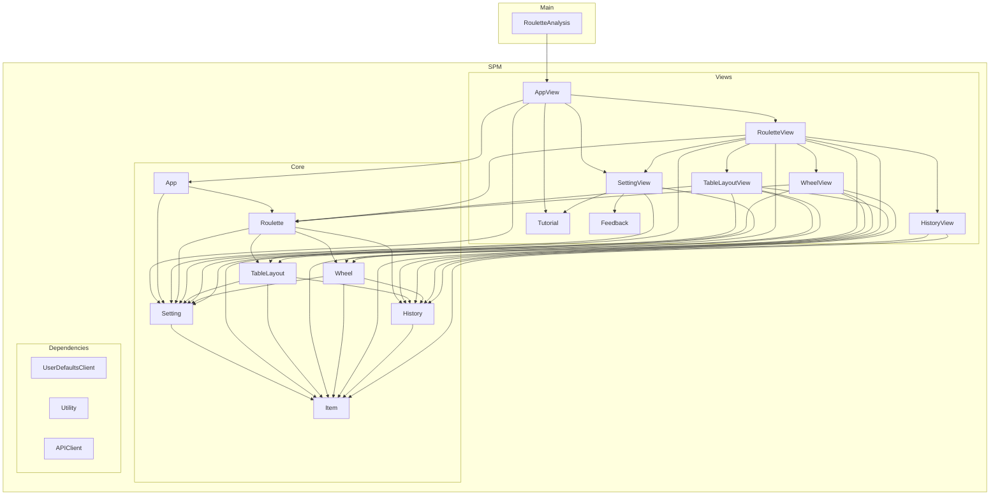

# RouletteAnalysis

|                                                                                         |                                                                                 |
| --------------------------------------------------------------------------------------------------- | --------------------------------------------------------------------------------------------- |
|  |  |

# Dependencies Graph
Powerd by [ Ryu0118/swift-dependencies-graph](https://github.com/Ryu0118/swift-dependencies-graph) & [ChatGPT](https://chat.openai.com/?model=gpt-4)

